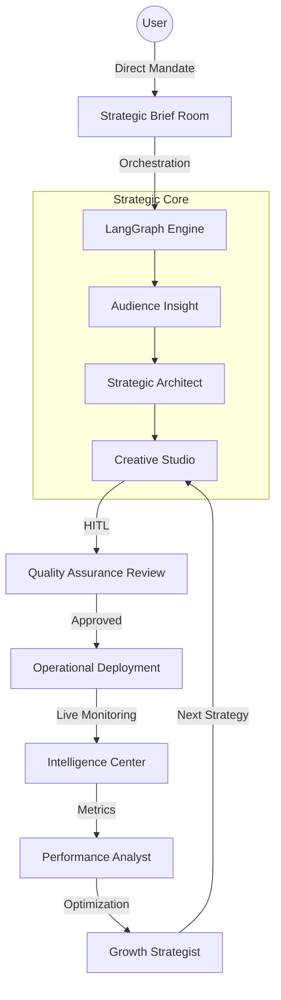

# Nudge — AI WhatsApp Campaign CRM

**Nudge is a multi-tenant AI WhatsApp Campaign CRM for businesses.** It lets teams
upload contacts, build approved-template campaigns, track delivery/read/replies,
automatically capture interested leads, and hand conversations over to humans —
**without configuring Meta APIs manually.**

> The money loop: **Campaigns → replies → leads → CRM.**

### Quick start

```bash
cp .env.example .env
docker compose up --build
```

| Service | URL |
|---|---|
| App | http://localhost:5174 |
| Backend API docs | http://localhost:8000/docs |
| WhatsApp simulator docs | http://localhost:9000/docs |

Sign up, or use the seeded demo: **`demo@campaignx.app` / `demo1234`**.
See [`DEMO.md`](DEMO.md) for the 2-minute demo walkthrough.

### How it works (no Meta account needed)

Every business connects its **own** WhatsApp number; one backend routes inbound
webhooks to the right tenant by `phone_number_id`. Messages are sent via the
[`pywa`](https://github.com/david-lev/pywa) WhatsApp Cloud API client, pointed at
a bundled **offline WhatsApp Cloud API Simulator** (`whatsapp-sim/`) that delivers
signed `delivered`/`read`/reply webhooks — so the full loop runs locally with no
credentials. Swap the simulator base URL for `graph.facebook.com` to go live.

### Feature map

- **Auth & multi-tenancy** — workspaces, JWT, per-tenant data isolation
- **WhatsApp connection** — each tenant connects its own number (mock Embedded Signup)
- **CRM** — contacts (CSV import, lists, tags), opt-in/opt-out consent
- **Templates** — create, categorize, submit for approval; campaigns send approved templates
- **Campaigns** — AI 5-agent pipeline (audience → copy → predict), list targeting, **scheduling**, **test send**, HITL approval
- **Analytics** — recipients/delivered/read/failed/replies/reply-rate/unsubscribes/leads/cost
- **Inbox + AI bot** — live conversations, AI auto-reply, **lead scoring**, human takeover
- **Leads** — auto-captured from reply intent, status pipeline
- **Plans & billing** — Free/Pro tiers, usage metering, mock checkout

---

<details>
<summary>Engineering detail: the WhatsApp engagement loop</summary>

```
Agent send_campaign ──► pywa.send_message ──► WhatsApp Cloud API Simulator
                                                      │ (signed x-hub-signature-256)
   EO/EC metrics ◄── pywa webhook handlers ◄── delivered → read → button-tap
```

- **Outbound:** `pywa` is pointed at the simulator via a `base_url` override, so a "send" is a real Cloud API call shape against a local mock; each tenant sends from its own `phone_number_id`.
- **Inbound:** the simulator schedules content-sensitive engagement and posts signed webhooks to `/api/whatsapp/webhook`; pywa runs with `filter_updates=False` so one app serves many numbers.
- **Tracker:** every message carries `biz_opaque_callback_data = "{broadcast_id}:{customer_id}"`, which round-trips on read receipts and button taps to update the exact `whatsapp_messages` row.
</details>

---

## 📡 WhatsApp engagement loop

```
Agent send_campaign ──► pywa.send_message ──► WhatsApp Cloud API Simulator
                                                      │ (signed x-hub-signature-256)
   EO/EC metrics ◄── pywa webhook handlers ◄── delivered → read → button-tap
```

- **Outbound:** `pywa` is pointed at the simulator via a `base_url` override, so a "send" is a real Cloud API call shape against a local mock.
- **Inbound:** the simulator schedules content-sensitive engagement (concise, emoji-rich, CTA copy earns higher read/click rates) and posts signed webhooks to `/api/whatsapp/webhook`.
- **Tracker:** every message carries `biz_opaque_callback_data = "{broadcast_id}:{customer_id}"`, which round-trips on read receipts and button taps to update the exact `whatsapp_messages` row.

---

## 📐 Strategic Architecture



### Strategic Agent Command
| Phase | Domain | Objective |
|---|---|---|
| **Insight** | Audience Profiling | Enrichment of 1,000+ customer data points for granular targeting |
| **Strategy** | A/B Architecture | Mathematical derivation of high-yield customer segments and send windows |
| **Creative** | Content Engineering | Generation of subject lines and bodies with verified ML conversion hooks |
| **Analytics** | Performance Intelligence | Real-time intake of EC/EO metrics from the strategic deployment layer |
| **Growth** | Continuous Optimization | Bayesian loop to refine creativity based on live performance data |

---

## ⚡ Accelerated Setup (Docker)

### Prerequisites

- **Docker Desktop** (v4.20+)
- **Ollama** (optional — running on the host for richer copy; the agents fall back
  to deterministic strategies if it is unavailable)

> No WhatsApp/Meta account or API keys are required — the bundled
> **WhatsApp Cloud API Simulator** handles all messaging offline.

### 1. Initialization

```bash
git clone https://github.com/CodeCrusherG/Revqara.git
cd Revqara
cp .env.example .env
```

The defaults in `.env.example` already wire the backend to the simulator. Set an
Ollama endpoint (use `http://host.docker.internal:11434` for Docker) if you want
LLM-generated copy. **`WA_APP_SECRET` must be identical** for the backend and the
simulator (both default to `campaignx_sim_secret`).

### 2. Operational Launch

```bash
# (optional) serve a model for richer copy
ollama run glm-5:cloud

# Start the full stack — db + backend + whatsapp-sim + frontend
docker compose up --build -d
```

### 3. Access Command Layers

| Module | Access Link | Description |
|---|---|---|
| **Strategic Studio** | [http://localhost:5173](http://localhost:5173) | Primary Mandate & Review Interface |
| **Intelligence Center** | [http://localhost:5173/dashboard](http://localhost:5173/dashboard) | Live Performance & Orchestration Trace |
| **Settings** | [http://localhost:5173/settings](http://localhost:5173/settings) | Workspace, AI model & connection |
| **API Blueprint** | [http://localhost:8000/docs](http://localhost:8000/docs) | Backend API Schemas |
| **WhatsApp Simulator** | [http://localhost:9000/docs](http://localhost:9000/docs) | Cloud API Simulator Schemas |

---

## 🏢 Multi-tenant SaaS

Nudge is a multi-workspace SaaS: each account signs up, gets an isolated
**workspace**, and manages its own contacts, lists, campaigns, and plan.

- **Accounts & auth** — JWT signup/login; every API call and DB query is scoped
  to the caller's workspace (`/api/auth/*`).
- **Contacts CRM** — add contacts manually, **import a CSV**, or load demo data;
  each contact carries a WhatsApp number plus optional CRM/demographic fields
  (`/api/contacts`).
- **Contact lists** — group contacts into named audiences (`/api/lists`).
- **Campaign targeting** — a campaign targets **all contacts or a specific list**;
  sends go only to that audience.
- **Plans, usage & billing** — Free/Pro tiers with enforced limits (contacts,
  daily sends), live usage metering, and a (mocked, offline) checkout that flips
  the plan — swap in Stripe to go live (`/api/billing/*`).

## 🛠️ Product Features

### 📡 Plan usage
The sidebar shows a live **Plan usage** meter tracking your daily API-call allowance against your plan limit.

### 📋 Campaigns list
Browse, search, and open any of your recent campaigns — each card shows its status, date, and read/click rates. Every campaign is persisted with its full reasoning trace.

### 🔍 AI Activity (Glass-Box Reasoning)
View the internal logic of the agents as they process your campaign. Every decision from profiling to content generation is logged with technical reasoning.

---

## 🧪 Operational Testing

### Automated E2E Flow
Validate your end-to-end connectivity including the 1,000 customer cohort fetch:

```bash
chmod +x test_flow.sh
./test_flow.sh
```

---

## 📄 License & Credits
Nudge — an AI-powered WhatsApp campaign studio. Built with FastAPI, LangGraph, pywa, and a bundled WhatsApp Cloud API simulator.
